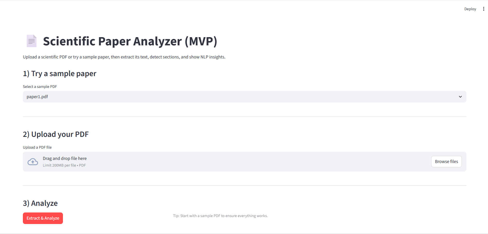
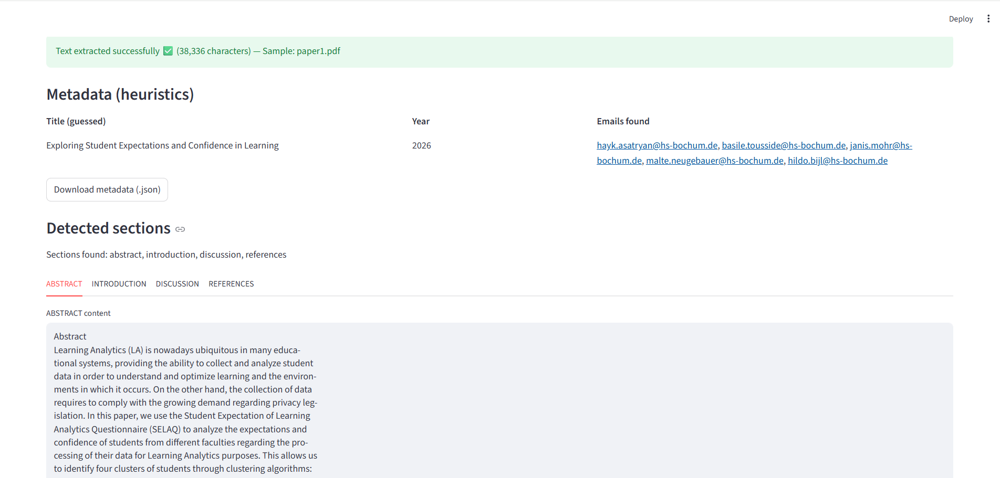
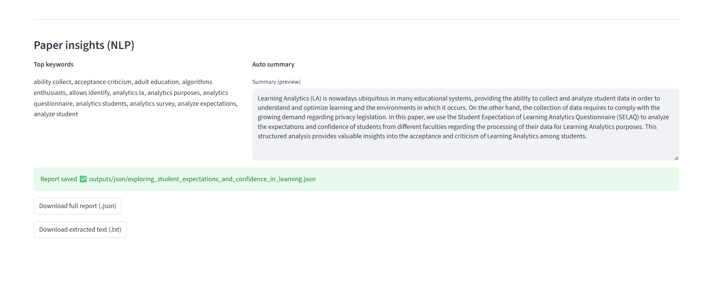

# Scientific Paper Analyzer (MVP)

An interactive NLP-based application to analyze scientific papers (PDF).  
The application extracts structured information from research papers and provides automatic insights using NLP techniques.

---

## 🎯 Project Overview

This project demonstrates how **Natural Language Processing (NLP)** can be applied to scientific documents to:
- Understand document structure
- Extract meaningful keywords
- Generate concise summaries
- Identify metadata automatically

It is designed as a **lightweight MVP**, suitable for academic analysis, research assistance, and as a foundation for more advanced document intelligence systems.

---

## 🚀 Features

- 📄 **PDF text extraction**
- 🧠 **Automatic section detection** (Abstract, Introduction, Discussion, References…)
- 🔑 **Keyword extraction** using TF-IDF
- ✂️ **Automatic summarization** with TextRank
- 🏷 **Metadata extraction** (title, year, author emails)
- 🖥 **Interactive Streamlit web interface**
- 📦 **Exportable JSON report** (full analysis)

---

## 🖼 Application Screenshots

### 1️⃣ Upload & Sample Selection
The user can upload a scientific PDF or choose a sample paper.



---

### 2️⃣ Metadata & Section Detection
Automatic extraction of title, year, emails, and document structure.



---

### 3️⃣ NLP Insights
Keyword extraction and automatic summary of the paper.



---

## 🛠 Tech Stack

- **Python**
- **Streamlit** (UI)
- **Scikit-learn** (TF-IDF)
- **Sumy** (TextRank summarization)
- **PDF parsing libraries** (text extraction)
- **Regex & heuristics** for metadata detection

---

## ▶️ How to Run Locally

```bash
# Install dependencies
pip install -r requirements.txt

# Launch the Streamlit app
streamlit run app/app.py
